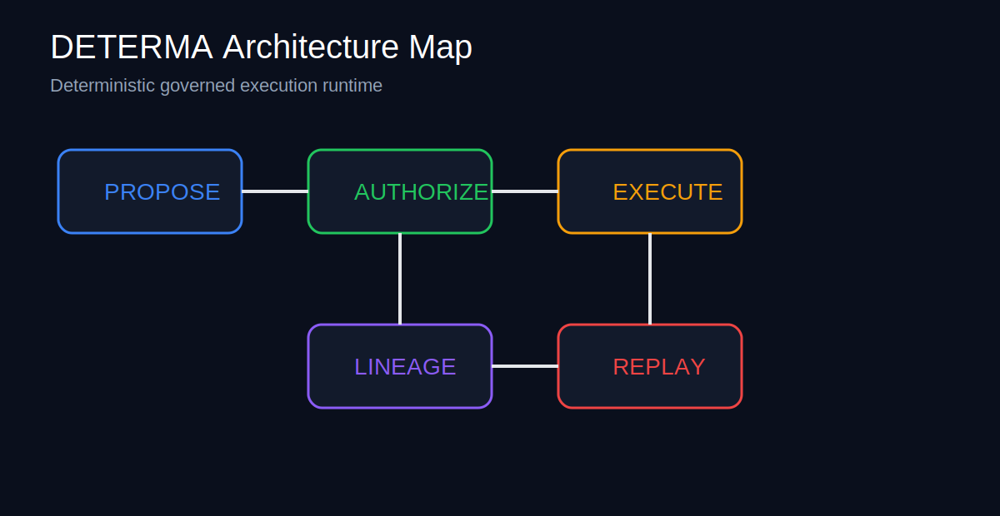

# DETERMA

> Deterministic governed execution infrastructure for AI systems.

[](#runtime-proof-suite)
[](#runtime-proof-suite)
[](#runtime-proof-suite)
[](#runtime-proof-suite)

AI systems are becoming execution systems.

DETERMA verifies whether execution itself is authorized, replayable, recoverable, append-only traceable, and deterministically reproducible.



---

## What is implemented now

This repository contains a governed runtime proof baseline with executable Python runtime modules, SQLite-backed lineage, recovery logic, proof inspectors, and pytest validation.

Core implementation areas:

```text
runtime/
  replay.py
  recovery_runtime.py
  orchestrator_loop.py
  lineage_viewer.py
  runtime_visualizer.py
  proof_inspector.py
  tests/

receipts/
  runtime_proof_snapshot.json
  canonical_release_baseline.json
  release_lineage.jsonl
```

---

## Runtime Proof Suite

Current proof baseline:

```text
45 / 45 PASSING
```

Verified guarantees:

| Guarantee | Status |
|---|---|
| Deterministic replay | VERIFIED |
| Append-only lineage | VERIFIED |
| Replay prevention | VERIFIED |
| Fail-closed authority checks | VERIFIED |
| Crash recovery | VERIFIED |
| Cross-process coordination | VERIFIED |
| Corruption detection | VERIFIED |
| Restoration equivalence | VERIFIED |
| Signed release baseline | VERIFIED |

---

## Quickstart

```bash
python -m venv .venv
source .venv/bin/activate
pip install -r requirements.txt
```

Run the proof suite:

```bash
python -m pytest runtime/tests -v
```

Inspect proof artifacts:

```bash
python -m runtime.proof_inspector
```

Visualize runtime lineage:

```bash
python -m runtime.runtime_visualizer
```

---

## Runtime model

```text
VERIFY -> AUTHORIZE -> EXECUTE -> PERSIST -> REPLAY -> RESTORE
```

DETERMA intentionally avoids hidden governance, in-memory trust assumptions, fake replay semantics, mutable audit history, and approval-only security theater.

---

## Public scope

This repository demonstrates a governed execution runtime kernel.

It does not yet claim:

- production-scale infrastructure guarantees
- universal agent orchestration
- full distributed authority federation
- complete multi-system governance coverage

The current focus is a strict, executable governed runtime baseline.

---

## Documentation

- [Architecture](docs/ARCHITECTURE.md)
- [Execution Flow](docs/EXECUTION_FLOW.md)
- [Threat Model](docs/THREAT_MODEL.md)
- [Security Model](docs/SECURITY_MODEL.md)
- [Release Baseline](docs/RELEASE_BASELINE.md)
- [Quickstart](docs/QUICKSTART.md)
- [Roadmap](ROADMAP.md)

---

## Category

```text
Governed Execution Infrastructure
```

Core reflex:

```text
Before trusting AI execution, verify the runtime lineage.
```
