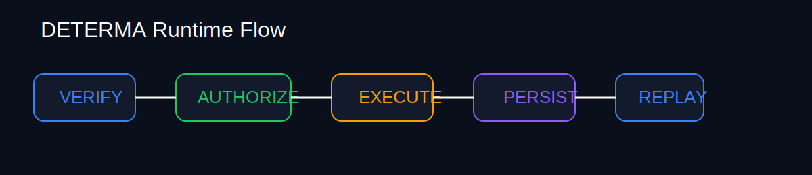
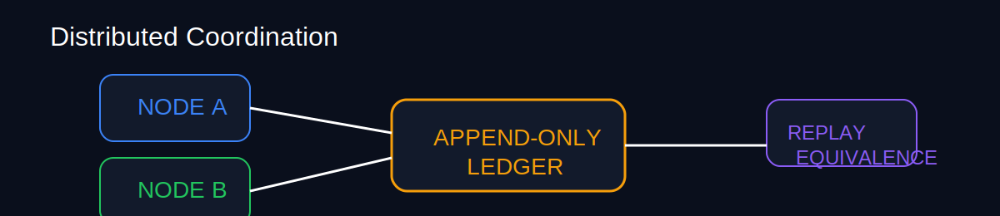

# DETERMA

> Deterministic Governed Execution Infrastructure for AI Systems

[](#runtime-proof-suite)
[](#deterministic-replay)
[](#append-only-lineage)
[](#signed-release-baseline)
[](#crash-recovery)
[](#distributed-coordination)

---

AI systems are becoming execution systems.

DETERMA verifies whether execution itself is:

- authorized
- replayable
- recoverable
- append-only verifiable
- deterministically reproducible

---



---

## Runtime Proof Suite

Current governed runtime proof suite:

```text
45 / 45 PASSING
```

| Runtime Domain | Status |
|---|---|
| Deterministic Replay | VERIFIED |
| Append-Only Persistence | VERIFIED |
| Crash Recovery | VERIFIED |
| Replay Mutation Prevention | VERIFIED |
| Authority Enforcement | VERIFIED |
| Distributed Coordination | VERIFIED |
| Multi-Process Recovery | VERIFIED |
| Cross-Host Ledger Validation | VERIFIED |
| Storage Atomicity | VERIFIED |
| Corrupted-Ledger Detection | VERIFIED |
| Restoration Equivalence | VERIFIED |
| Remote GitHub Governance | VERIFIED |
| Immutable Release Baseline | VERIFIED |

---

## Why Execution Legitimacy Matters

Modern AI systems can:

- mutate infrastructure
- alter deployment behavior
- modify CI/CD pipelines
- change distributed operational state
- execute irreversible actions
- coordinate cross-system side effects

The problem is no longer generation.

The problem is execution legitimacy.

DETERMA validates whether execution itself is trustworthy.

---

## Governed Runtime Flow

```text
VERIFY
   ↓
AUTHORIZE
   ↓
EXECUTE
   ↓
PERSIST
   ↓
REPLAY
   ↓
RESTORE
```

---

## Architecture Principles

The runtime is designed around:

```text
verify -> authorize -> execute -> persist -> replay -> restore
```

DETERMA intentionally avoids:

- hidden governance
- in-memory trust assumptions
- fake replay semantics
- mutable audit history
- approval-only security theater
- non-deterministic recovery

---

## Deterministic Replay

Every governed action can be replayed deterministically.

Replay validation detects:

- corruption
- divergence
- mutation tampering
- lineage inconsistency

---

## Append-Only Lineage

Runtime lineage is append-only.

Mutation attempts against prior lineage entries are blocked.

The system validates:

- monotonic sequencing
- immutable receipts
- deterministic digest continuity
- restoration equivalence

---

## Fail-Closed Authority Enforcement

Execution requires:

- capability authorization
- witness validation
- lock ownership
- replay-safe execution state

Invalid authority state blocks execution before mutation.

---

## Crash Recovery

The runtime supports:

- interruption recovery
- stale lock recovery
- replay reconstruction
- deterministic lifecycle restoration

---

## Distributed Coordination

Validated scenarios include:

- concurrent node contention
- multi-process coordination
- cross-host append-only lineage
- network partition fail-closed behavior
- deterministic distributed replay equivalence



---

## Corruption Detection

The runtime validates:

- physical SQLite corruption detection
- replay refusal on integrity violation
- append-only restoration continuity
- immutable recovery semantics

---

## Signed Release Baseline

The repository includes:

- immutable runtime proof snapshots
- signed release baselines
- append-only release lineage
- deterministic restoration proofs

Release integrity is verified in CI.

DETERMA supports:

```text
Sigstore / Cosign keyless verification
```

This allows independent validation of release authenticity.

---

## Security Model

DETERMA security is not based on hidden source code.

The system assumes:

```text
trust must be externally verifiable
```

The repository intentionally exposes:

- replay proofs
- runtime verification logic
- append-only lineage validation
- restoration semantics
- corruption handling

while protecting:

- production credentials
- signing authority
- deployment infrastructure
- operational secrets

See:

```text
SECURITY.md
```

---

## Repository Structure

```text
runtime/
  replay.py
  recovery_runtime.py
  orchestrator_loop.py
  tests/

receipts/
  runtime_proof_snapshot.json
  canonical_release_baseline.json
  release_lineage.jsonl

docs/assets/
  runtime-flow.svg
  distributed-coordination.svg

.github/workflows/
  runtime-release-baseline.yml
  release-signing-verification.yml
  security-secrets-scan.yml
```

---

## Quick Start

### Install

```bash
python -m venv .venv
source .venv/bin/activate
pip install -r requirements.txt
```

### Run Replay

```bash
python -m runtime.replay
```

### Run Recovery Runtime

```bash
python -m runtime.recovery_runtime
```

### Run Orchestrator

```bash
python -m runtime.orchestrator_loop
```

### Execute Runtime Proof Suite

```bash
python -m pytest runtime/tests -v
```

---

## Runtime Philosophy

DETERMA does not attempt to prove that AI is aligned.

It proves whether execution is:

- authorized
- replayable
- recoverable
- deterministic
- append-only verifiable

---

## Current Status

```text
Governed Runtime Proof Baseline Frozen
```

Includes:

- signed release baseline
- immutable proof snapshot
- deterministic restoration validation
- append-only release lineage

---

## Category

```text
Governed Execution Infrastructure
```

Core reflex:

```text
Before trusting AI execution,
verify the runtime lineage.
```
