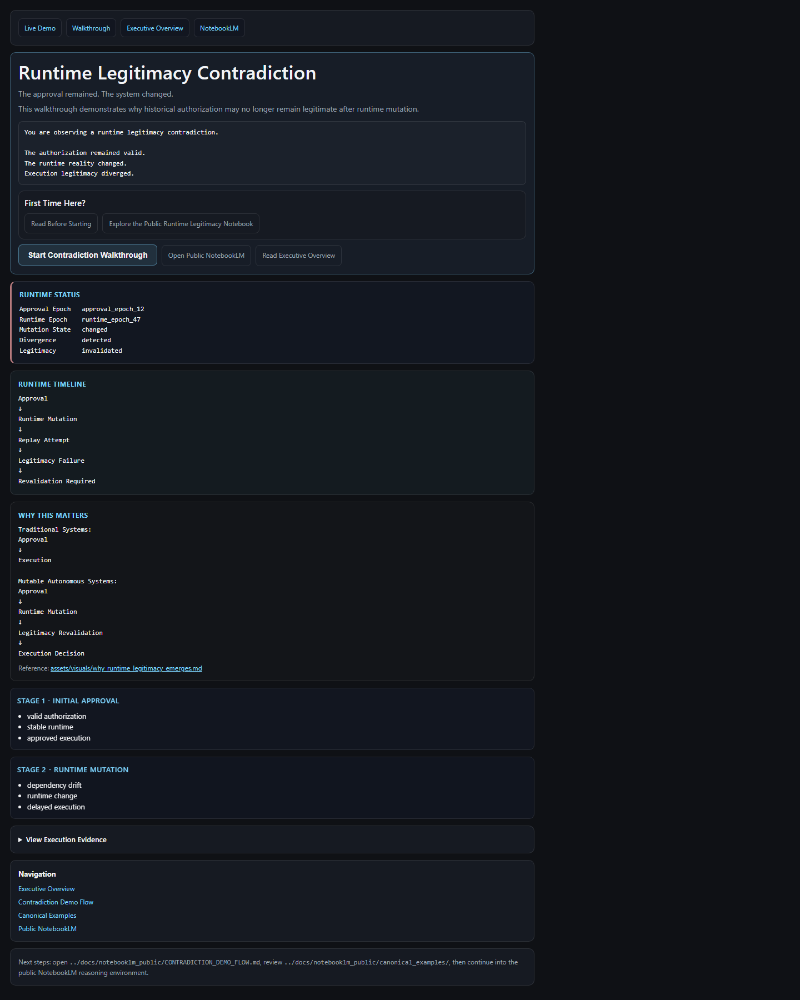
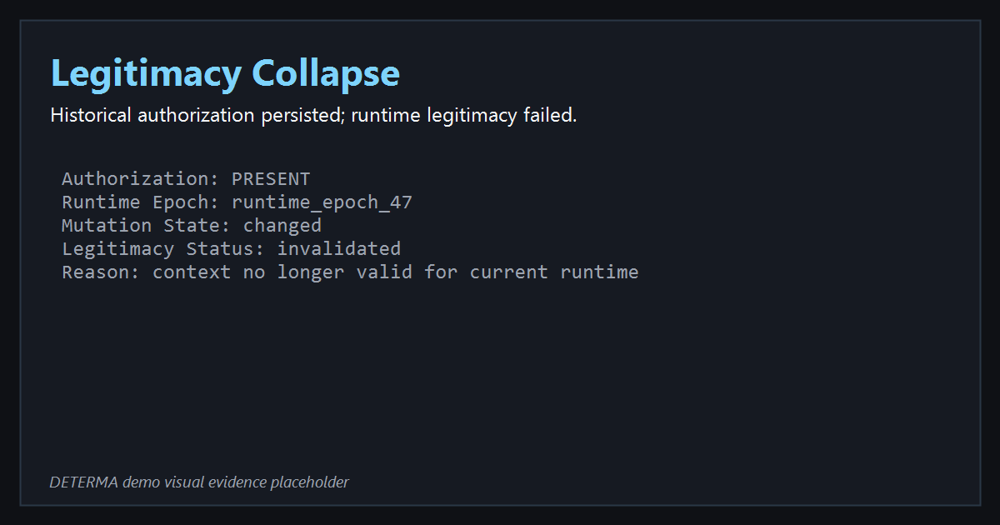
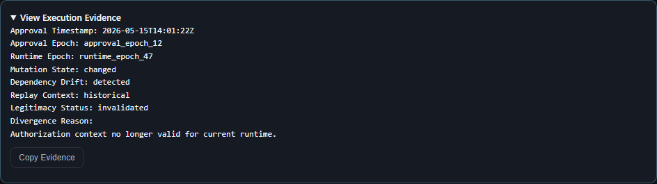

# DETERMA — Runtime Legitimacy Infrastructure

## Live Interactive Contradiction Demo

👉 [Open the Live Demo](https://determaai.github.io/DETERMA-v0.1-Governed-Runtime-Proof-Baseline/)

👉 [Read Before Starting](docs/notebooklm_public/FIRST_DEMO_WALKTHROUGH.md)

👉 [Explore the Public NotebookLM](https://notebooklm.google.com/notebook/607349dd-c101-4675-8c94-377e9a585e2b?authuser=1)

---

The approval remained.  
The system changed.

# Try The Demo Now

👉 [https://determaai.github.io/DETERMA-v0.1-Governed-Runtime-Proof-Baseline/](https://determaai.github.io/DETERMA-v0.1-Governed-Runtime-Proof-Baseline/)

# Start Here

| Experience | Open |
|---|---|
| Interactive Runtime Legitimacy Demo | [Launch Demo](https://determaai.github.io/DETERMA-v0.1-Governed-Runtime-Proof-Baseline/) |
| Demo Walkthrough | [Read Walkthrough](docs/notebooklm_public/FIRST_DEMO_WALKTHROUGH.md) |
| Executive Overview | [Read Overview](docs/notebooklm_public/EXECUTIVE_FIELD_OVERVIEW.md) |
| Contradiction Flow | [View Flow](docs/notebooklm_public/CONTRADICTION_DEMO_FLOW.md) |
| Public NotebookLM | [Open NotebookLM](https://notebooklm.google.com/notebook/607349dd-c101-4675-8c94-377e9a585e2b?authuser=1) |

## What The Demo Shows

```text
Approval Granted
        ↓
Runtime Changed
        ↓
Execution Resumed
        ↓
Legitimacy Failed
```

DETERMA demonstrates how historically valid authorization can become illegitimate under changing runtime conditions.

## Runtime Legitimacy Contradiction



## Runtime Divergence


## Legitimacy Collapse



## Execution Evidence



## Live Demo Status

GitHub Pages live walkthrough entrypoint:

[https://determaai.github.io/DETERMA-v0.1-Governed-Runtime-Proof-Baseline/](https://determaai.github.io/DETERMA-v0.1-Governed-Runtime-Proof-Baseline/)

## Real Operational Failure Modes

Modern autonomous execution systems already exhibit legitimacy contradictions such as:

- delayed CI/CD execution after runtime drift
- stale deployment approvals
- replayed runtime actions under changed environments
- dependency mutation after authorization
- long-running execution chains
- execution/runtime mismatch
- authority continuity breakdown

These contradictions emerge even without malicious behavior.

## Why Existing Governance Systems Are Insufficient

Traditional governance systems generally validate approval history.

DETERMA evaluates whether execution remains legitimate after runtime mutation, delayed execution, dependency drift, and environment divergence.

This distinction becomes increasingly important in autonomous execution systems.

## Why This Category Emerges

Modern autonomous systems increasingly execute across delayed timelines, mutable runtimes, dependency drift, and replayable authority contexts.

Under these conditions, historical approval alone becomes insufficient.

## Current Maturity

DETERMA currently demonstrates:

- runtime legitimacy contradiction modeling
- replay legitimacy invalidation
- runtime divergence reasoning
- execution evidence generation
- legitimacy revalidation semantics

The framework does not yet claim hyperscale deployment maturity or distributed legitimacy consensus infrastructure.

## What DETERMA Is Not

DETERMA is not:

- an AI model
- an observability platform
- a workflow orchestration framework
- a policy engine
- a monitoring wrapper
- a generic AI governance dashboard

DETERMA defines a separate category:

runtime legitimacy infrastructure.

## Additional Entry Surfaces

- [Demo Quickstart](DEMO_QUICKSTART.md)
- [Investor Fast Path](INVESTOR_FAST_PATH.md)
- [Public Entrypoint](PUBLIC_ENTRYPOINT.md)
- [Demo Entrypoint Doc](docs/notebooklm_public/DEMO_ENTRYPOINT.md)
- [Operational Validation Layer](docs/notebooklm_public/WHAT_DETERMA_HAS_PROVEN.md)

## Disclosure Boundary

Operational runtime internals, orchestration mechanics, and implementation-sensitive enforcement materials are intentionally excluded from this public repository surface.
