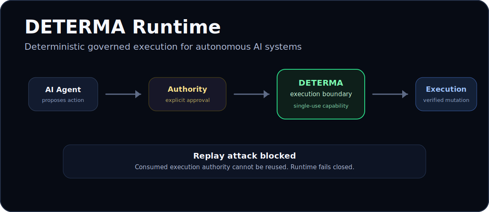

<div align="center">

# DETERMA Runtime

### Deterministic Governed Execution for Autonomous AI Systems

AI systems can generate actions.  
DETERMA governs whether those actions are allowed to mutate real systems.

<p>
  
</p>

<p>
  
  
  
  
</p>

</div>

---

# Governed Execution for AI Systems

DETERMA demonstrates a governed execution runtime where:

- AI-generated mutations are intercepted before execution
- execution authority is explicitly issued
- execution capabilities are single-use
- replay attacks fail closed
- runtime lineage remains append-only
- deterministic replay verifies execution legitimacy

Unlike traditional AI safety layers that focus on prompts or outputs, DETERMA governs execution authority itself.

---

# Run the Governed Execution Demonstration

<div align="center">

| Demo Mode | Command |
|---|---|
| One-command demo | `python scripts/demo_governed_flow.py` |
| Interactive dashboard | `uvicorn runtime.api_shell:app --host 0.0.0.0 --port 8000` |
| Docker runtime | `docker compose -f docker-compose.runtime.yml up` |

</div>

Then open:

```text
http://localhost:8000/demo
```

---

# Explore the DETERMA Runtime Architecture

All canonical replay, lineage, governance, runtime, and threat-model documents are searchable through the interactive DETERMA architecture notebook.

## Interactive Architecture Notebook

👉 https://notebooklm.google.com/notebook/1c7fd705-9634-48e7-9249-4b06a0a6a2ef?authuser=8

---

## Suggested Questions

- How does deterministic replay work?
- Why are capabilities single-use?
- How does DETERMA prevent replay attacks?
- What happens if runtime state changes?
- How does append-only lineage work?
- Why govern execution instead of prompts?
- How does DETERMA differ from approval workflows?

---

# Governed Execution Flow

```text
AI
 ↓
Proposal
 ↓
Authority Boundary
 ↓
Capability Issuance
 ↓
Governed Execution
 ↓
Replay Verification
 ↓
Replay Attack Blocked
```

---

# Why Existing AI Governance Is Not Enough

```text
Prompt
 ↓
Model
 ↓
Agent
 ↓
Mutation Attempt
 ↓
DETERMA Execution Boundary
 ↓
Governed Execution
```

Most AI governance systems focus on:

- prompts
- outputs
- orchestration
- observability
- approvals

DETERMA focuses on the execution boundary itself.

Even compromised or manipulated AI systems cannot mutate governed systems without explicitly issued execution authority.

---

# Architectural Comparison

| Category | Typical Approach | Limitation | DETERMA Approach |
|---|---|---|---|
| Prompt Security | Filter prompts | Cannot govern execution | Governs execution authority |
| Approval Workflows | Human approval | Approvals can be replayed | Single-use execution capabilities |
| Observability Platforms | Detect after execution | Mutation already occurred | Fail-closed execution boundary |
| Agent Frameworks | Orchestration | Execution trust assumed | Execution trust verified |
| RBAC / IAM | Identity control | Not replay-aware | Replay-verifiable lineage |

---

# Without Governance vs With DETERMA

| Without Governance | With DETERMA |
|---|---|
| execution occurs immediately | execution is intercepted |
| replay attempts can succeed | replay attacks fail closed |
| authority is implicit | authority is explicit |
| fail-open behavior | fail-closed behavior |
| mutation trust is assumed | mutation trust is verified |

---

# Runtime Guarantees Verified

<div align="center">

| Guarantee | Status |
|---|---|
| Deterministic replay | ✅ Verified |
| Append-only lineage | ✅ Verified |
| Replay prevention | ✅ Verified |
| Fail-closed authority checks | ✅ Verified |
| Crash recovery | ✅ Verified |
| Cross-process coordination | ✅ Verified |
| Corruption detection | ✅ Verified |
| Restoration equivalence | ✅ Verified |
| Container parity | ✅ Verified |

</div>

---

# Documentation Map

## Core Runtime

| Document | Purpose |
|---|---|
| `README.md` | Product overview and governed execution entrypoint |
| `runtime/` | Canonical runtime implementation |
| `runtime/github_governor.py` | Governed GitHub mutation flow |
| `runtime/api_shell.py` | Thin observability/API layer |

## Replay and Integrity

| Document | Purpose |
|---|---|
| `docs/core/AUTHORITY_LEDGER.md` | Append-only lineage model |
| `docs/core/EXECUTION_CONVERGENCE.md` | Deterministic replay guarantees |
| `docs/core/CANONICAL_STOP_CONDITION.md` | Fail-closed execution semantics |
| `docs/core/ANTI_FAKE_IMPLEMENTATION.md` | Runtime legitimacy constraints |

## Threat and Governance

| Document | Purpose |
|---|---|
| `docs/core/THREAT_SCENARIOS.md` | Attack and compromise scenarios |
| `docs/core/CANONICAL_LANGUAGE.md` | Canonical governance terminology |
| `docs/core/RUNTIME_SUCCESS_CRITERIA.md` | Runtime legitimacy conditions |

## Runtime Proofs and Receipts

| Document | Purpose |
|---|---|
| `receipts/` | Replay-verifiable runtime artifacts |
| `receipts/runtime_proof_snapshot.json` | Canonical replay proof snapshot |
| `receipts/release_lineage.jsonl` | Append-only release lineage |

---

# Runtime Principles

```text
AI proposes.
Authority decides.
Execution is verified.
Replay is reproducible.
Lineage is append-only.
```

The runtime preserves:

- deterministic replay
- append-only lineage
- fail-closed execution
- replay digest consistency
- restoration equivalence
- single-use capability semantics
- authority-bound execution

---

# Product Direction

DETERMA is evolving toward deterministic governed execution infrastructure focused on:

- governed AI mutations
- replay-verifiable execution
- append-only lineage
- authority-bound execution
- recoverable runtime workflows
- fail-closed mutation governance

---

# Explore the Runtime

Run the governed execution ceremony:

```bash
python scripts/demo_governed_flow.py
```

Open the runtime dashboard:

```text
http://localhost:8000/demo
```

Explore the architecture notebook:

👉 https://notebooklm.google.com/notebook/1c7fd705-9634-48e7-9249-4b06a0a6a2ef?authuser=8
