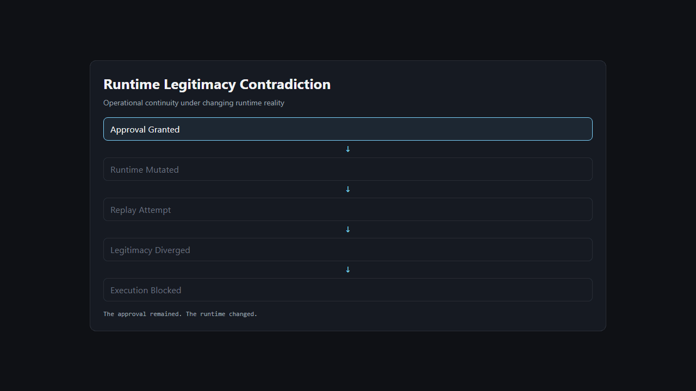
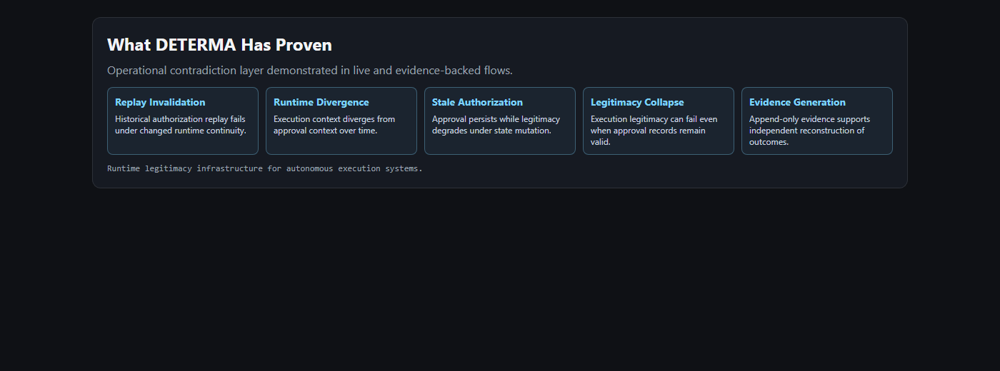

# DETERMA — Runtime Legitimacy Infrastructure

[Launch Live Demo](https://determaai.github.io/DETERMA-v0.1-Governed-Runtime-Proof-Baseline/)



## Public Runtime Status

```text
Live Demo: ACTIVE
Pages Deployment: ACTIVE
Runtime Sessions: ENABLED
Evidence Export: VERIFIED
NotebookLM Surface: ONLINE
```

Public runtime integrity is continuously verified against deployed Pages state.

## Recent Public Runtime Updates

- deployment timestamp: 2026-05-15T00:00:00Z
- runtime session engine: persistent lineage + evidence archive enabled
- evidence export layer: copy + txt/md export verified in demo surface
- latest deployment verification: deployment legitimacy pass completed

## Executive Entry

- [Board-Level Overview](docs/notebooklm_public/BOARD_LEVEL_ONE_PAGER.html)
- [Why DETERMA Exists](docs/notebooklm_public/WHY_DETERMA_EXISTS.html)
- [Live Runtime Legitimacy Demo](https://determaai.github.io/DETERMA-v0.1-Governed-Runtime-Proof-Baseline/)
- [Public NotebookLM](https://notebooklm.google.com/notebook/607349dd-c101-4675-8c94-377e9a585e2b?authuser=1)

```text
The approval remained.
The runtime changed.
Execution legitimacy diverged.
```

## 30-Second Understanding

```text
Traditional systems ask:

"Was this approved?"

DETERMA asks:

"Is this execution still legitimate under the current runtime reality?"
```

## Why Existing Systems Fail

Modern autonomous systems increasingly execute across:

- delayed execution windows
- mutable runtimes
- dependency drift
- replayable authority contexts
- continuously changing system state

Under these conditions, historical approval alone becomes insufficient.

## Runtime Legitimacy & DATP

DETERMA treats runtime legitimacy as a first-class execution control surface.
Historical approval remains important, but it is not sufficient once runtime reality changes.

DATP (Deterministic Authority Transition Protocol) is the runtime authority model beneath DETERMA.
It governs how execution authority can transition from intent to mutation without assuming that historical approval is still valid.

DATP framing in public scope:
- fail-closed mutation governance
- bounded execution authority
- authority continuity checks before mutation
- immutable authority lineage after execution decisions

Runtime authority flow:

```text
Intent Generation
-> Authority Validation
-> Runtime Legitimacy Evaluation
-> Scoped Execution Grant
-> Constrained Executor
-> Verification
-> Immutable Authority Lineage
```

Public DATP references:
- [DATP Public Overview](docs/public/DATP_PUBLIC_OVERVIEW.md)
- [First Contradiction](docs/public/FIRST_CONTRADICTION.md)
- [Runtime Legitimacy](docs/public/RUNTIME_LEGITIMACY.md)
- [Immutable Authority Lineage](docs/public/IMMUTABLE_AUTHORITY_LINEAGE.md)
- [Governed Autonomous Execution](docs/public/GOVERNED_AUTONOMOUS_EXECUTION.md)
- [Market Positioning](docs/public/MARKET_POSITIONING.md)

## Architecture

DETERMA governs mutation authority beneath probabilistic intelligence systems without replacing those systems.

```text
Probabilistic Intelligence Layer
-> DATP Runtime Authority Layer
-> Constrained Mutation Layer
-> Verification Layer
-> Immutable Lineage Layer
```

## Start Here

1. [Launch the live contradiction demo](https://determaai.github.io/DETERMA-v0.1-Governed-Runtime-Proof-Baseline/)
2. [Read the walkthrough](docs/notebooklm_public/FIRST_DEMO_WALKTHROUGH.md)
3. [Open Why DETERMA Exists](docs/notebooklm_public/WHY_DETERMA_EXISTS.html)
4. [Open Ontology Map](docs/notebooklm_public/ONTOLOGY_MAP.html)
5. [Open Public NotebookLM](https://notebooklm.google.com/notebook/607349dd-c101-4675-8c94-377e9a585e2b?authuser=1)

## What DETERMA Demonstrates



- replay invalidation conditions
- runtime divergence under delayed execution
- stale authorization persistence
- legitimacy collapse under changed runtime context
- reconstructable execution evidence

## Compression Pages

- [Board-Level One Pager](docs/notebooklm_public/BOARD_LEVEL_ONE_PAGER.html)
- [Executive PDF Export Source](docs/notebooklm_public/EXECUTIVE_PDF_EXPORT_SOURCE.html)
- [Why DETERMA Exists](docs/notebooklm_public/WHY_DETERMA_EXISTS.html)
- [Field Compression](docs/notebooklm_public/FIELD_COMPRESSION.html)
- [Field Evolution Timeline](docs/notebooklm_public/FIELD_EVOLUTION_TIMELINE.html)
- [What Runtime Legitimacy Changes](docs/notebooklm_public/WHAT_RUNTIME_LEGITIMACY_CHANGES.html)
- [Category Positioning Matrix](docs/notebooklm_public/CATEGORY_POSITIONING_MATRIX.html)
- [Proof Progress Timeline](docs/notebooklm_public/PROOF_PROGRESS_TIMELINE.html)
- [Deployment Integrity Matrix](docs/notebooklm_public/DEPLOYMENT_INTEGRITY_MATRIX.html)
- [Ontology Map](docs/notebooklm_public/ONTOLOGY_MAP.html)
- [Deployment Verification Protocol](DEPLOYMENT_VERIFICATION_PROTOCOL.md)
- [Public Convergence Checklist](PUBLIC_CONVERGENCE_CHECKLIST.md)

## Investor Fast Path

Use [INVESTOR_FAST_PATH.md](INVESTOR_FAST_PATH.md) for a 5-minute flow.

## Disclosure Boundary

Operational runtime internals, orchestration mechanics, and implementation-sensitive enforcement materials are intentionally excluded from this public repository surface.
