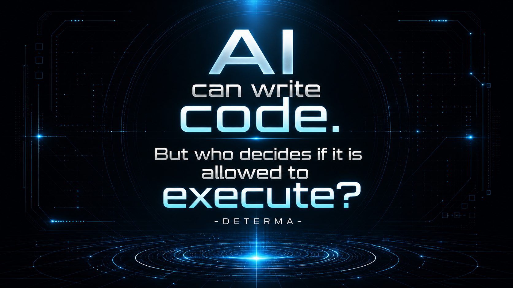

# DETERMA — Governed AI Execution

**AI can write code.
But who decides if it is allowed to execute?**

## 🎬 40-second demo — how DETERMA blocks unsafe AI execution
[](https://youtu.be/ek8jdOmWAvw?si=EAnV1VU1bMnOSZZv)

DETERMA is an execution authority layer that prevents AI-generated changes from running unless all required conditions are verified.

---

## 🚨 The Problem

AI coding agents can:

* open pull requests automatically
* repeat actions (replay)
* mutate code after approval
* operate outside intended scope

There is no strict enforcement layer between **AI intent** and **actual execution**.

---

## ✅ What this demo proves

* AI changes are **not executed automatically**
* Every action requires a strict authority chain:

```text
approval → capability → state witness → execution release
```

* Replay attacks are blocked (idempotent execution)
* Adversarial attempts fail closed

---

## ⚡ Quick Demo (30 seconds)

```bash
make demo
make demo-attack
```

### Expected result

* Draft PR is created (mock or real)
* Second run is blocked (no duplicate execution)
* Attack scenarios → **ALL BLOCKED (FAIL-CLOSED)**

---

## ⚙️ GitHub Action

Run directly in your repo:

```yaml
steps:
  - uses: actions/checkout@v4
  - uses: DETERMAai/determa-demo-action@v0.1.0
    with:
      operator-token: demo-token
```

This executes a governed AI change flow inside GitHub.

---

## 🧪 Demo Modes

### Default (Mock Mode)

* Zero setup
* No GitHub writes
* Safe for evaluation

### Real GitHub Sandbox (Optional)

Creates a **Draft PR** in a controlled repo.

```bash
export DETERMA_DEMO_REAL_GITHUB=1
export GITHUB_TOKEN=your_token
export DETERMA_DEMO_REPO=org/demo-repo
export DETERMA_DEMO_BASE_BRANCH=main
```

Then run:

```bash
make demo-real
```

---

## 🔐 Safety

* No auto-merge
* No writes to protected branches
* Fail-closed by default
* Real mode requires explicit opt-in

---

## 🧯 Troubleshooting

**Execution blocked**
→ Missing approval / capability / witness / release

**GitHub 422 error**
→ Invalid branch or base/head mismatch

**No PR created**
→ Running in mock mode (expected behavior)

---

## 📌 What this is (and isn’t)

This is:

* A **governed execution layer demo**
* A proof of deterministic control over AI actions

This is NOT:

* A production system
* A general AI agent framework
* A CI/CD replacement

---

## 📊 Status

Demo / design-partner stage
Not production-ready

---

## 🤝 Contact

Looking for engineering teams using AI coding agents who want execution control.

* Email: determa.ai@gmail.com
* GitHub: open an issue with label `design-partner`

---

## 🧠 Core Idea

AI can propose.
**DETERMA decides what is allowed to run.**
